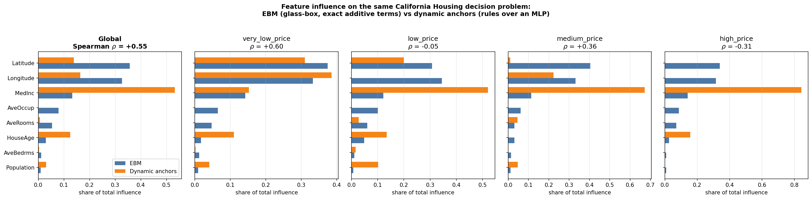

# EBM vs Dynamic Anchors — California Housing

Both methods explain the **same 4-class quartile decision problem** on the same 80/20 stratified split (seed 42).

## Models

| Model | Role | Test performance |
|---|---|---|
| EBM regressor | notebook reproduction check | R² = 0.8333 (notebook: 0.8332, terms identical: True) |
| EBM classifier | glass-box reference | accuracy = 0.7643 |
| MLP (dnn) | the model anchors explain | accuracy = 0.7643 (full data) |

> **Caveat on all reported accuracies.** Model selection maximises accuracy on X_test across epochs and the LR scheduler also steps on test accuracy, so these figures are optimistic. EBM's number is an honest held-out score; the MLP's is not. A validation split carved from training data would fix this and has not been implemented.

## How feature influence is defined

| | EBM | Dynamic anchors |
|---|---|---|
| Quantity | mean \|contribution of term to class-c logit\| | precision(box) − precision(box with feature *j* relaxed) |
| Explains | its own additive structure | the trained MLP's decision function |
| Aggregation | mean over test rows of class c | unweighted mean over the class's anchor boxes (each rule counts once) |
| Interactions | explicit 2D terms, split 50/50 onto their features | implicit — a box is a conjunction, so influence is already joint |

## Global agreement

Spearman ρ = **+0.548** (p = 0.1600)

Sensitivity — collapsing repeated rule feature-sets to one vote each (so `{MedInc}` counts once however many anchors use it): ρ = **+0.500** (p = 0.2070). A large gap between the two would mean the ranking is driven by how OFTEN a feature is used rather than how much it matters when used.

| Class | Distinct feature-sets | Median pairwise Jaccard | Max Jaccard | Pairs J>0.5 |
|---|---:|---:|---:|---:|
| class_0 | 22 | 0.000 | 0.568 | 0.1% |
| class_1 | 15 | 0.006 | 0.857 | 1.7% |
| class_2 | 19 | 0.127 | 0.799 | 4.5% |
| class_3 | 21 | 0.000 | 0.800 | 0.2% |

Near-zero Jaccard means the boxes cover essentially disjoint rows, so no region contributes its features twice. Feature-sets do repeat across those disjoint regions, which is what the dedup sensitivity above tests.

| Feature | Anchor influence share | EBM importance share | Anchor rank | EBM rank |
|---|---:|---:|---:|---:|
| Latitude | 13.9% | 35.7% | 3 | 1 |
| Longitude | 16.4% | 32.7% | 2 | 2 |
| MedInc | 53.3% | 13.3% | 1 | 3 |
| AveOccup | 0.0% | 7.9% | 8 | 4 |
| AveRooms | 0.6% | 5.4% | 6 | 5 |
| HouseAge | 12.4% | 2.9% | 4 | 6 |
| AveBedrms | 0.3% | 1.1% | 7 | 7 |
| Population | 3.1% | 0.9% | 5 | 8 |

## Per-class agreement

| Class | ρ | Anchor top-3 | EBM top-3 | Anchor boxes | Mean rule precision | Mean coverage |
|---|---:|---|---|---:|---:|---:|
| very_low_price | +0.60 | Longitude, Latitude, MedInc | Latitude, Longitude, MedInc | 60 | 0.760 | 0.0145 |
| low_price | -0.05 | MedInc, Latitude, HouseAge | Longitude, Latitude, MedInc | 60 | 0.362 | 0.1133 |
| medium_price | +0.36 | MedInc, Longitude, Population | Latitude, Longitude, MedInc | 60 | 0.316 | 0.2254 |
| high_price | -0.31 | MedInc, HouseAge, AveBedrms | Latitude, Longitude, MedInc | 60 | 0.742 | 0.0193 |

## Notes

- Rule bounds were read in **raw** feature space.
- Anchor precision is prediction-match, P(MLP predicts class c | x in box) — the same object EBM explains, so the two are measuring influence on a model, not on labels.
- EBM interaction terms are attributed 50/50 to their two features; the main-effect-only breakdown is in `ebm_influence.json` if you prefer it.
- Training was truncated to 144k frames (30 iterations) for every run in this series; none is converged. Rules come from the FINAL extracted models (inference defaults to `prefer_model="final"`), not from best_model.
- Geometric tightness (in `anchor_influence.json`) can rank quite differently from ablation influence: the features the boxes pin most tightly are not always the ones carrying precision. Tight != important, which is why ablation is the headline metric.
- Influence is an UNWEIGHTED mean over anchors. An earlier coverage-weighted version was dropped: coverage is skewed enough (top 5 of 60 boxes carrying ~40-50% of the weight) that a few huge boxes decided each result, and huge boxes barely react to relaxing one bound. That version reported Latitude at a 0.0% share for runs whose rules constrain Latitude in a third of cases, and made the EBM rank correlation swing between +0.81 and 0.00 across runs whose unweighted values were stable.
- `binding_fraction` in the JSON separates 'this feature is unconstrained' from 'constrained but precision-neutral'. Single-feature ablation cannot see redundancy: Latitude and Longitude jointly define a neighbourhood, so relaxing one while the other still binds understates the pair. That is the most likely reason anchors under-weight Latitude against EBM's Latitude & Longitude interaction term.